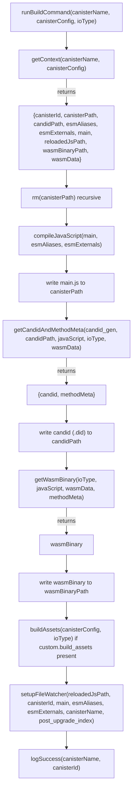

### Experimental build command flow

```mermaid
flowchart TD
  A["runBuildCommand(canisterName, canisterConfig, ioType)"] --> B["getContext(canisterName, canisterConfig)"]
  B -->|returns| C["{canisterId, canisterPath, candidPath, esmAliases, esmExternals, main, reloadedJsPath, wasmBinaryPath, wasmData}"]
  C --> D["rm(canisterPath) recursive"]
  D --> E["compileJavaScript(main, esmAliases, esmExternals)"]
  E --> F["write main.js to canisterPath"]
  F --> G["getCandidAndMethodMeta(candid_gen, candidPath, javaScript, ioType, wasmData)"]
  G -->|returns| H["{candid, methodMeta}"]
  H --> I["write candid (.did) to candidPath"]
  I --> J["getWasmBinary(ioType, javaScript, wasmData, methodMeta)"]
  J -->|returns| K["wasmBinary"]
  K --> L["write wasmBinary to wasmBinaryPath"]
  L --> M["buildAssets(canisterConfig, ioType) if custom.build_assets present"]
  M --> N["setupFileWatcher(reloadedJsPath, canisterId, main, esmAliases, esmExternals, canisterName, post_upgrade_index)"]
  N --> O["logSuccess(canisterName, canisterId)"]

  %% Deep links to components
  click B "src/experimental/build/commands/build/get_context.ts" "Open getContext"
  click E "src/experimental/build/commands/build/javascript.ts" "Open JavaScript compiler"
  click G "src/experimental/build/commands/build/candid_and_method_meta/index.ts" "Open candid/meta generation"
  click J "src/experimental/build/commands/build/wasm_binary/index.ts" "Open wasm binary builder"
  click M "src/experimental/build/commands/build/index.ts" "Open buildAssets implementation"
  click N "src/experimental/build/commands/build/file_watcher/setup_file_watcher.ts" "Open file watcher setup"
```
