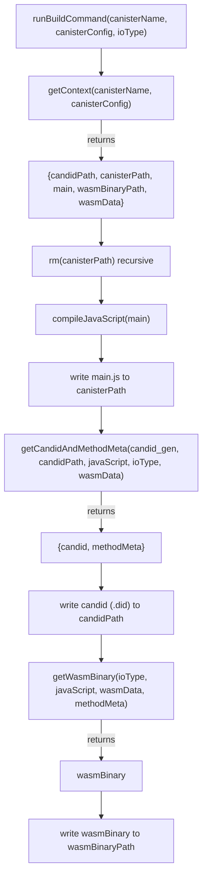

### Stable build command flow

```mermaid
flowchart TD
  A["runBuildCommand(canisterName, canisterConfig, ioType)"] --> B["getContext(canisterName, canisterConfig)"]
  B -->|returns| C["{candidPath, canisterPath, main, wasmBinaryPath, wasmData}"]
  C --> D["rm(canisterPath) recursive"]
  D --> E["compileJavaScript(main)"]
  E --> F["write main.js to canisterPath"]
  F --> G["getCandidAndMethodMeta(candid_gen, candidPath, javaScript, ioType, wasmData)"]
  G -->|returns| H["{candid, methodMeta}"]
  H --> I["write candid (.did) to candidPath"]
  I --> J["getWasmBinary(ioType, javaScript, wasmData, methodMeta)"]
  J -->|returns| K["wasmBinary"]
  K --> L["write wasmBinary to wasmBinaryPath"]

  %% Deep links to components
  click B "src/stable/build/commands/build/get_context.ts" "Open getContext"
  click E "src/stable/build/commands/build/javascript.ts" "Open JavaScript compiler"
  click G "src/stable/build/commands/build/candid_and_method_meta/index.ts" "Open candid/meta generation"
  click J "src/stable/build/commands/build/wasm_binary/index.ts" "Open wasm binary builder"
```
