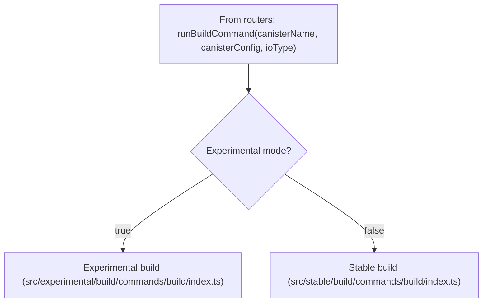

### Build command overview

```mermaid
flowchart TD
  A["From routers: runBuildCommand(canisterName, canisterConfig, ioType)"] --> B{"Experimental mode?"}
  B -->|"true"| C["Experimental build (src/experimental/build/commands/build/index.ts)"]
  B -->|"false"| D["Stable build (src/stable/build/commands/build/index.ts)"]

  %% Navigation
  click C "azle-build-flow-experimental.md" "Open experimental build flow"
  click D "azle-build-flow-stable.md" "Open stable build flow"
```
