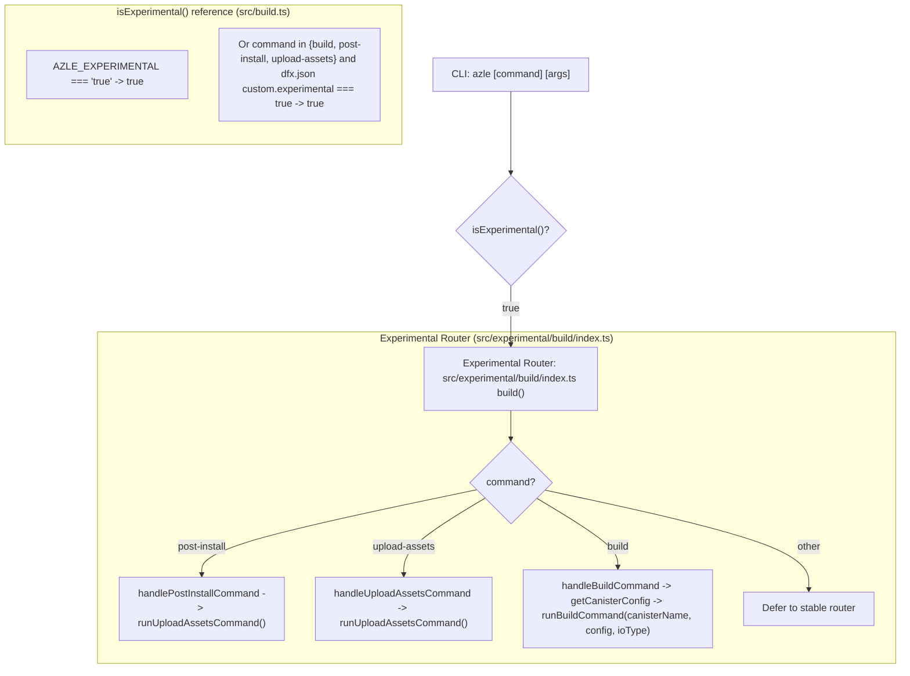

### Experimental build flow

```mermaid
flowchart TD
  A["CLI: azle [command] [args]"] --> B{"isExperimental()?"}
  B -->|"true"| C["Experimental Router: src/experimental/build/index.ts build()"]

  subgraph EXP ["Experimental Router (src/experimental/build/index.ts)"]
    direction TB
    C --> D{"command?"}
    D -->|"post-install"| E["handlePostInstallCommand -> runUploadAssetsCommand()"]
    D -->|"upload-assets"| F["handleUploadAssetsCommand -> runUploadAssetsCommand()"]
    D -->|"build"| G["handleBuildCommand -> getCanisterConfig -> runBuildCommand(canisterName, config, ioType)"]
    D -->|"other"| H["Defer to stable router"]
  end

  subgraph EXPLOGIC ["isExperimental() reference (src/build.ts)"]
    direction TB
    X1["AZLE_EXPERIMENTAL === 'true' -> true"]
    X2["Or command in {build, post-install, upload-assets} and dfx.json custom.experimental === true -> true"]
  end

  %% Navigation links
  click H "azle-flow-stable.md" "Open stable flow"
```
