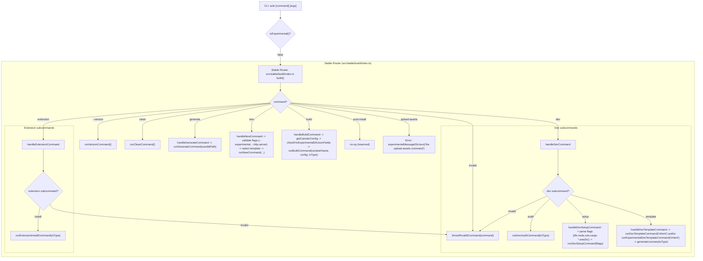

### Stable build flow

```mermaid
flowchart TD
  A["CLI: azle [command] [args]"] --> B{"isExperimental()?"}
  B -->|"false"| C["Stable Router: src/stable/build/index.ts build()"]

  subgraph STABLE ["Stable Router (src/stable/build/index.ts)"]
    direction TB
    C --> D{"command?"}

    D -->|"--version"| E["runVersionCommand()"]
    D -->|"clean"| F["runCleanCommand()"]
    D -->|"generate"| G["handleGenerateCommand -> runGenerateCommand(candidPath)"]
    D -->|"new"| H["handleNewCommand -> validate flags (--experimental, --http-server) -> select template -> runNewCommand(...)"]
    D -->|"build"| I["handleBuildCommand -> getCanisterConfig -> checkForExperimentalDfxJsonFields -> runBuildCommand(canisterName, config, ioType)"]
    D -->|"dev"| J["handleDevCommand"]
    D -->|"extension"| K["handleExtensionCommand"]
    D -->|"post-install"| L["no-op (reserved)"]
    D -->|"upload-assets"| M["Error: experimentalMessageDfxJson('the upload-assets command')"]
    D -->|"invalid"| N["throwIfInvalidCommand(command)"]

    subgraph DEV ["Dev subcommands"]
      direction TB
      J --> J1{"dev subcommand?"}
      J1 -->|"audit"| J2["runDevAuditCommand(ioType)"]
      J1 -->|"setup"| J3["handleDevSetupCommand -> parse flags [dfx,node,rust,cargo-*,wasi2ic] -> runDevSetupCommand(flags)"]
      J1 -->|"template"| J4["handleDevTemplateCommand -> runDevTemplateCommand('inherit') and/or runExperimentalDevTemplateCommand('inherit') -> generateLicenses(ioType)"]
      J1 -->|"invalid"| N
    end

    subgraph EXT ["Extension subcommands"]
      direction TB
      K --> K1{"extension subcommand?"}
      K1 -->|"install"| K2["runExtensionInstallCommand(ioType)"]
      K1 -->|"invalid"| N
    end
  end

  %% Navigation links
  click C "azle-flow-experimental.md" "Open experimental flow"
```
