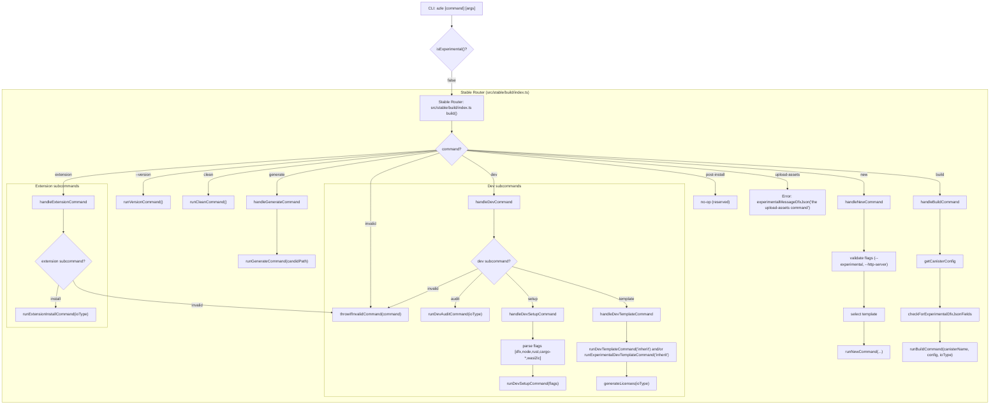

### Stable build flow

```mermaid
flowchart TD
  A["CLI: azle [command] [args]"] --> B{"isExperimental()?"}
  B -->|"false"| C["Stable Router: src/stable/build/index.ts build()"]

  subgraph STABLE ["Stable Router (src/stable/build/index.ts)"]
    direction TB
    C --> D{"command?"}

    D -->|"--version"| E["runVersionCommand()"]
    D -->|"clean"| F["runCleanCommand()"]
    D -->|"generate"| G1["handleGenerateCommand"]
    G1 --> G2["runGenerateCommand(candidPath)"]
    D -->|"new"| H1["handleNewCommand"]
    H1 --> H2["validate flags (--experimental, --http-server)"]
    H2 --> H3["select template"]
    H3 --> H4["runNewCommand(...)"]
    D -->|"build"| I1["handleBuildCommand"]
    I1 --> I2["getCanisterConfig"]
    I2 --> I3["checkForExperimentalDfxJsonFields"]
    I3 --> I4["runBuildCommand(canisterName, config, ioType)"]
    D -->|"dev"| J["handleDevCommand"]
    D -->|"extension"| K["handleExtensionCommand"]
    D -->|"post-install"| L["no-op (reserved)"]
    D -->|"upload-assets"| M["Error: experimentalMessageDfxJson('the upload-assets command')"]
    D -->|"invalid"| N["throwIfInvalidCommand(command)"]

    subgraph DEV ["Dev subcommands"]
      direction TB
      J --> J1{"dev subcommand?"}
      J1 -->|"audit"| J2["runDevAuditCommand(ioType)"]
      J1 -->|"setup"| J3a["handleDevSetupCommand"]
      J3a --> J3b["parse flags [dfx,node,rust,cargo-*,wasi2ic]"]
      J3b --> J3c["runDevSetupCommand(flags)"]
      J1 -->|"template"| J4a["handleDevTemplateCommand"]
      J4a --> J4b["runDevTemplateCommand('inherit') and/or runExperimentalDevTemplateCommand('inherit')"]
      J4b --> J4c["generateLicenses(ioType)"]
      J1 -->|"invalid"| N
    end

    subgraph EXT ["Extension subcommands"]
      direction TB
      K --> K1{"extension subcommand?"}
      K1 -->|"install"| K2["runExtensionInstallCommand(ioType)"]
      K1 -->|"invalid"| N
    end
  end

  %% Navigation links
  click C "azle-flow-experimental.md" "Open experimental flow"
```
