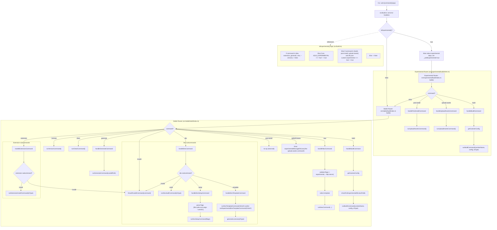

### Azle build flow overview

```mermaid
flowchart TD
  A["CLI: azle [command] [args]"] --> B["src/build.ts: set error handlers"]
  B --> C{"isExperimental()?"}

  C -->|"true"| D["Warn about experimental deps; set _azleExperimental=true"]
  C -->|"false"| F["Stable Router: src/stable/build/index.ts build()"]
  D --> E["Experimental Router: src/experimental/build/index.ts build()"]

  subgraph EXP ["Experimental Router (src/experimental/build/index.ts)"]
    direction TB
    E --> G{"command?"}
    G -->|"post-install"| H1["handlePostInstallCommand"]
    H1 --> H2["runUploadAssetsCommand()"]
    G -->|"upload-assets"| I1["handleUploadAssetsCommand"]
    I1 --> I2["runUploadAssetsCommand()"]
    G -->|"build"| J1["handleBuildCommand"]
    J1 --> J2["getCanisterConfig"]
    J2 --> J3["runBuildCommand(canisterName, config, ioType)"]
    G -->|"other"| F
  end

  subgraph STABLE ["Stable Router (src/stable/build/index.ts)"]
    direction TB
    F --> K{"command?"}

    K -->|"--version"| L["runVersionCommand()"]
    K -->|"clean"| M["runCleanCommand()"]
    K -->|"generate"| N1["handleGenerateCommand"]
    N1 --> N2["runGenerateCommand(candidPath)"]
    K -->|"new"| O1["handleNewCommand"]
    O1 --> O2["validate flags (--experimental, --http-server)"]
    O2 --> O3["select template"]
    O3 --> O4["runNewCommand(...)"]
    K -->|"build"| P1["handleBuildCommand"]
    P1 --> P2["getCanisterConfig"]
    P2 --> P3["checkForExperimentalDfxJsonFields"]
    P3 --> P4["runBuildCommand(canisterName, config, ioType)"]
    K -->|"dev"| Q["handleDevCommand"]
    K -->|"extension"| R["handleExtensionCommand"]
    K -->|"post-install"| S["no-op (reserved)"]
    K -->|"upload-assets"| T["Error: experimentalMessageDfxJson('the upload-assets command')"]
    K -->|"invalid"| U["throwIfInvalidCommand(command)"]

    subgraph DEV ["Dev subcommands"]
      direction TB
      Q --> Q1{"dev subcommand?"}
      Q1 -->|"audit"| Q2["runDevAuditCommand(ioType)"]
      Q1 -->|"setup"| Q3a["handleDevSetupCommand"]
      Q3a --> Q3b["parse flags [dfx,node,rust,cargo-*,wasi2ic]"]
      Q3b --> Q3c["runDevSetupCommand(flags)"]
      Q1 -->|"template"| Q4a["handleDevTemplateCommand"]
      Q4a --> Q4b["runDevTemplateCommand('inherit') and/or runExperimentalDevTemplateCommand('inherit')"]
      Q4b --> Q4c["generateLicenses(ioType)"]
      Q1 -->|"invalid"| U
    end

    subgraph EXT ["Extension subcommands"]
      direction TB
      R --> R1{"extension subcommand?"}
      R1 -->|"install"| R2["runExtensionInstallCommand(ioType)"]
      R1 -->|"invalid"| U
    end
  end

  subgraph EXPLOGIC ["isExperimental() logic (src/build.ts)"]
    direction TB
    X1["If command in {dev, extension, generate, new, --version} -> false"]
    X2["Else if env AZLE_EXPERIMENTAL === 'true' -> true"]
    X3["Else if command in {build, post-install, upload-assets} and dfx.json custom.experimental === true -> true"]
    X4["Else -> false"]
  end
  C -. "references" .-> EXPLOGIC
  %% Navigation links
  click E "azle-flow-experimental.md" "Open experimental flow"
  click F "azle-flow-stable.md" "Open stable flow"
  click P4 "azle-build-flow.md" "Open build command overview"
```
