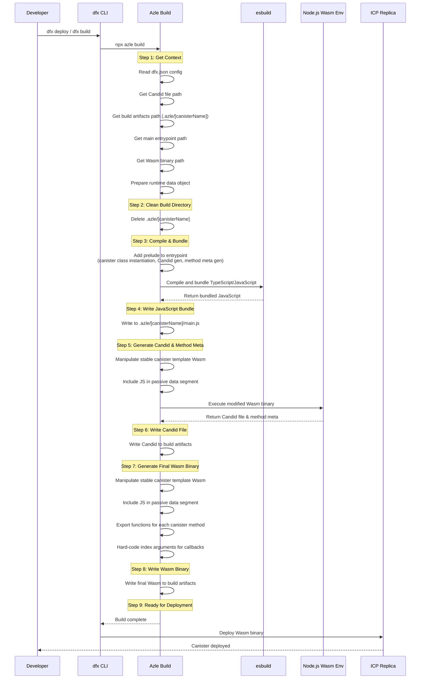

# Azle's build process

```mermaid
sequenceDiagram
    participant Dev as Developer
    participant DFX as dfx CLI
    participant Azle as Azle Build
    participant ESBuild as esbuild
    participant NodeWasm as Node.js Wasm Env
    participant ICP as ICP Replica

    Dev->>DFX: dfx deploy / dfx build
    DFX->>Azle: npx azle build

    Note over Azle: Step 1: Get Context
    Azle->>Azle: Read dfx.json config
    Azle->>Azle: Get Candid file path
    Azle->>Azle: Get build artifacts path (.azle/[canisterName])
    Azle->>Azle: Get main entrypoint path
    Azle->>Azle: Get Wasm binary path
    Azle->>Azle: Prepare runtime data object

    Note over Azle: Step 2: Clean Build Directory
    Azle->>Azle: Delete .azle/[canisterName]

    Note over Azle: Step 3: Compile & Bundle
    Azle->>Azle: Add prelude to entrypoint<br/>(canister class instantiation, Candid gen, method meta gen)
    Azle->>ESBuild: Compile and bundle TypeScript/JavaScript
    ESBuild-->>Azle: Return bundled JavaScript

    Note over Azle: Step 4: Write JavaScript Bundle
    Azle->>Azle: Write to .azle/[canisterName]/main.js

    Note over Azle: Step 5: Generate Candid & Method Meta
    Azle->>Azle: Manipulate stable canister template Wasm
    Azle->>Azle: Include JS in passive data segment
    Azle->>NodeWasm: Execute modified Wasm binary
    NodeWasm-->>Azle: Return Candid file & method meta

    Note over Azle: Step 6: Write Candid File
    Azle->>Azle: Write Candid to build artifacts

    Note over Azle: Step 7: Generate Final Wasm Binary
    Azle->>Azle: Manipulate stable canister template Wasm
    Azle->>Azle: Include JS in passive data segment
    Azle->>Azle: Export functions for each canister method
    Azle->>Azle: Hard-code index arguments for callbacks

    Note over Azle: Step 8: Write Wasm Binary
    Azle->>Azle: Write final Wasm to build artifacts

    Note over Azle: Step 9: Ready for Deployment
    Azle-->>DFX: Build complete
    DFX->>ICP: Deploy Wasm binary
    ICP-->>Dev: Canister deployed
```
