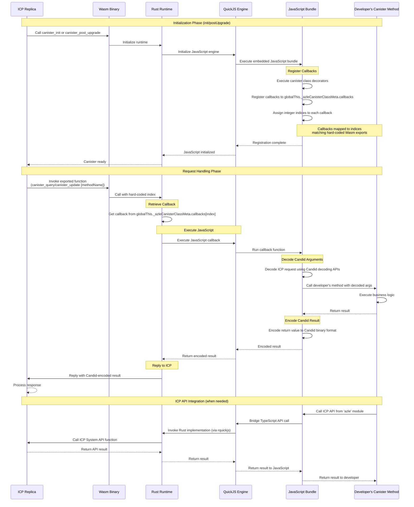

# Azle's runtime library

```mermaid
sequenceDiagram
    participant ICP as ICP Replica
    participant Wasm as Wasm Binary
    participant Rust as Rust Runtime
    participant QuickJS as QuickJS Engine
    participant JS as JavaScript Bundle
    participant DevCode as Developer's Canister Method

    Note over ICP,DevCode: Initialization Phase (init/postUpgrade)

    ICP->>Wasm: Call canister_init or canister_post_upgrade
    Wasm->>Rust: Initialize runtime
    Rust->>QuickJS: Initialize JavaScript engine
    QuickJS->>JS: Execute embedded JavaScript bundle

    Note over JS: Register Callbacks
    JS->>JS: Execute canister class decorators
    JS->>JS: Register callbacks to globalThis._azleCanisterClassMeta.callbacks
    JS->>JS: Assign integer indices to each callback

    Note over JS,DevCode: Callbacks mapped to indices<br/>matching hard-coded Wasm exports

    JS-->>QuickJS: Registration complete
    QuickJS-->>Rust: JavaScript initialized
    Rust-->>ICP: Canister ready

    Note over ICP,DevCode: Request Handling Phase

    ICP->>Wasm: Invoke exported function<br/>(canister_query/canister_update [methodName])
    Wasm->>Rust: Call with hard-coded index

    Note over Rust: Retrieve Callback
    Rust->>Rust: Get callback from globalThis._azleCanisterClassMeta.callbacks[index]

    Note over Rust,QuickJS: Execute JavaScript
    Rust->>QuickJS: Execute JavaScript callback
    QuickJS->>JS: Run callback function

    Note over JS: Decode Candid Arguments
    JS->>JS: Decode ICP request using Candid decoding APIs

    JS->>DevCode: Call developer's method with decoded args
    DevCode->>DevCode: Execute business logic
    DevCode-->>JS: Return result

    Note over JS: Encode Candid Result
    JS->>JS: Encode return value to Candid binary format

    JS-->>QuickJS: Encoded result
    QuickJS-->>Rust: Return encoded result

    Note over Rust: Reply to ICP
    Rust->>ICP: Reply with Candid-encoded result
    ICP-->>ICP: Process response

    Note over ICP,DevCode: ICP API Integration (when needed)

    DevCode->>JS: Call ICP API from 'azle' module
    JS->>QuickJS: Bridge TypeScript API call
    QuickJS->>Rust: Invoke Rust implementation (via rquickjs)
    Rust->>ICP: Call ICP System API function
    ICP-->>Rust: Return API result
    Rust-->>QuickJS: Return result
    QuickJS-->>JS: Return result to JavaScript
    JS-->>DevCode: Return result to developer
```
