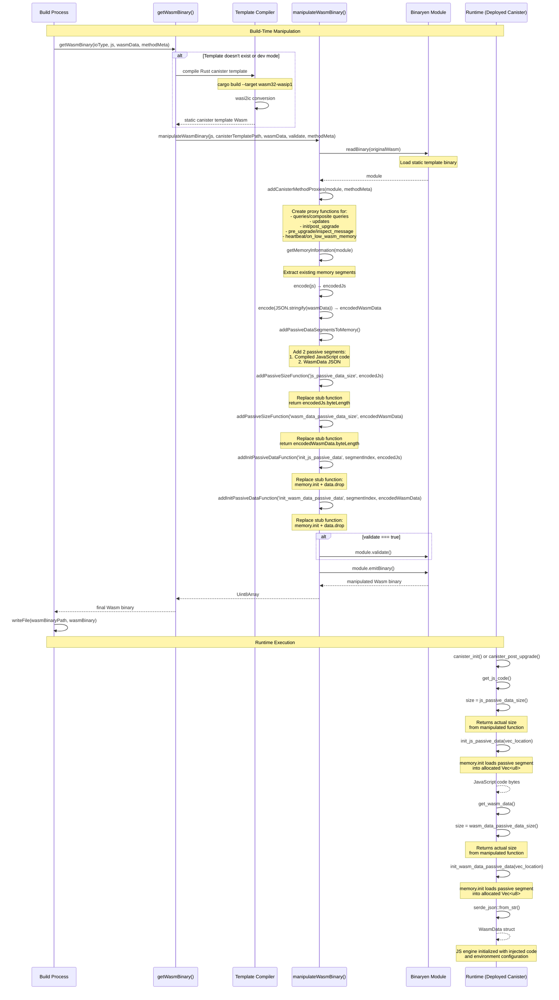

# Wasm Binary Manipulation Sequence Diagram

## Key Points

### Build-Time Manipulation

1. **Template Generation**: Rust canister template is compiled to Wasm with stub functions containing static dummy values
2. **Binary Loading**: Binaryen loads the template as a mutable module
3. **Method Proxies**: Canister method proxies are added for IC system API functions
4. **Data Encoding**: JavaScript code and WasmData are encoded as UTF-8 byte arrays
5. **Passive Segments**: Two passive data segments are added to the Wasm memory:
    - Segment N: Compiled JavaScript code
    - Segment N+1: Serialized WasmData JSON
6. **Function Replacement**: Stub functions are replaced with actual implementations:
    - `js_passive_data_size()`: Returns the actual byte length of the JavaScript code
    - `wasm_data_passive_data_size()`: Returns the actual byte length of the WasmData JSON
    - `init_js_passive_data()`: Uses `memory.init` to copy the passive segment into the provided memory location, then `data.drop` to free the segment
    - `init_wasm_data_passive_data()`: Same process for WasmData segment

### Runtime Execution

1. **Data Retrieval**: At runtime, `get_js_code()` and `get_wasm_data()` functions:
    - Call size functions to allocate correctly-sized vectors
    - Call init functions to load passive segments into memory
    - Return the populated byte arrays
2. **Deserialization**: WasmData is deserialized from JSON into a Rust struct
3. **JS Engine Initialization**: The JavaScript engine is initialized with the injected code and configuration

### Why This Approach?

- **Single Binary**: Avoids needing separate data files or build artifacts
- **Efficient**: Passive segments are only loaded when needed and can be dropped after initialization
- **Type-Safe**: Rust structs provide compile-time guarantees at runtime
- **Flexible**: Each canister deployment gets custom JavaScript and configuration baked in
