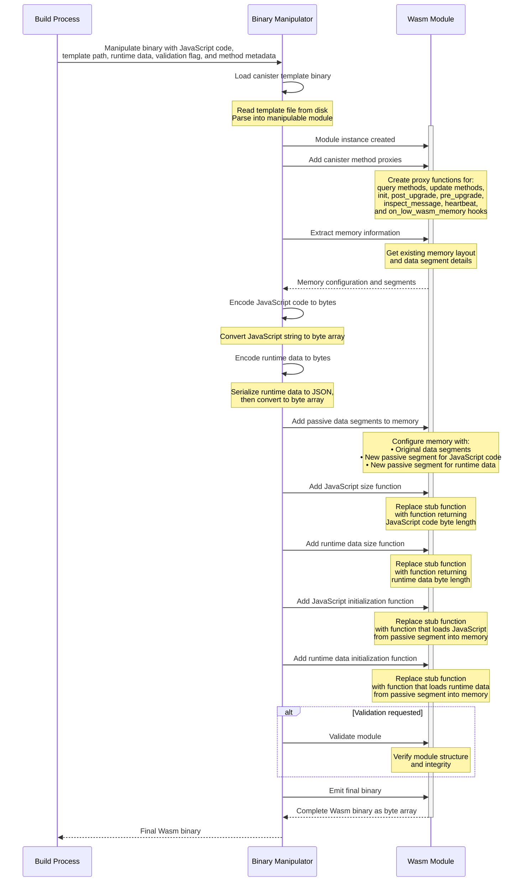

# Wasm Binary Manipulation Sequence Diagram

```mermaid
sequenceDiagram
    participant BuildProcess as Build Process
    participant Manipulator as Binary Manipulator
    participant Module as Wasm Module

    BuildProcess->>Manipulator: Manipulate binary with JavaScript code,<br/>template path, runtime data, validation flag, and method metadata

    Manipulator->>Manipulator: Load canister template binary
    Note over Manipulator: Read template file from disk<br/>Parse into manipulable module
    activate Module
    Manipulator->>Module: Module instance created

    Manipulator->>Module: Add canister method proxies
    Note over Module: Create proxy functions for:<br/>query methods, update methods,<br/>init, post_upgrade, pre_upgrade,<br/>inspect_message, heartbeat,<br/>and on_low_wasm_memory hooks

    Manipulator->>Module: Extract memory information
    Note over Module: Get existing memory layout<br/>and data segment details
    Module-->>Manipulator: Memory configuration and segments

    Manipulator->>Manipulator: Encode JavaScript code to bytes
    Note over Manipulator: Convert JavaScript string to byte array
    Manipulator->>Manipulator: Encode runtime data to bytes
    Note over Manipulator: Serialize runtime data to JSON,<br/>then convert to byte array

    Manipulator->>Module: Add passive data segments to memory
    Note over Module: Configure memory with:<br/>• Original data segments<br/>• New passive segment for JavaScript code<br/>• New passive segment for runtime data

    Manipulator->>Module: Add JavaScript size function
    Note over Module: Replace stub function<br/>with function returning<br/>JavaScript code byte length

    Manipulator->>Module: Add runtime data size function
    Note over Module: Replace stub function<br/>with function returning<br/>runtime data byte length

    Manipulator->>Module: Add JavaScript initialization function
    Note over Module: Replace stub function<br/>with function that loads JavaScript<br/>from passive segment into memory

    Manipulator->>Module: Add runtime data initialization function
    Note over Module: Replace stub function<br/>with function that loads runtime data<br/>from passive segment into memory

    alt Validation requested
        Manipulator->>Module: Validate module
        Note over Module: Verify module structure<br/>and integrity
    end

    Manipulator->>Module: Emit final binary
    Module-->>Manipulator: Complete Wasm binary as byte array
    deactivate Module

    Manipulator-->>BuildProcess: Final Wasm binary

```
